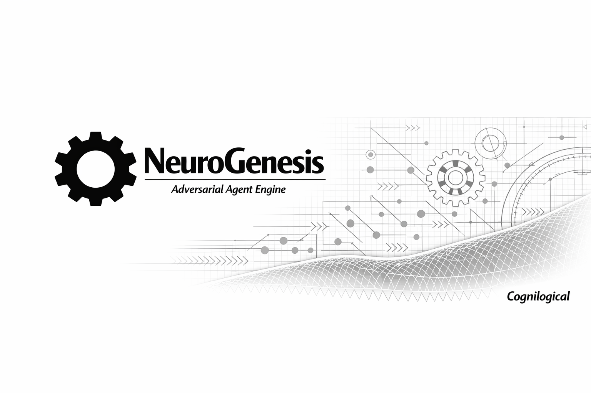
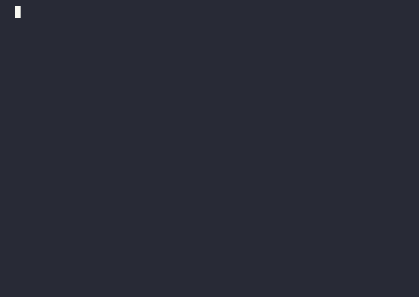

<div align="center">
  
</div>

# NeuroGenesis

**The Enterprise AI Architecture Compiler**



Build, secure, and ship a portable, self-auditing AI workforce directly inside your codebase. 

NeuroGenesis doesn't just generate generic chat bots. It compiles a structured team of specialized agents that operate with strict safety boundaries, debate complex decisions, and follow your exact compliance rules—ensuring you can scale autonomous AI without risking your production environment.

## Why NeuroGenesis?

### 🛡️ Ship Autonomy Safely (The Asymmetric Guard Pattern)
Giving an autonomous agent full `bash` access is a massive security risk, but forcing a human to approve every command destroys autonomy. NeuroGenesis solves this with a **Maker-Checker** architecture:
* **The Maker (Orchestrator):** A powerful, expensive model (like GPT-4o or Claude 3.5 Sonnet) that writes code and proposes system changes.
* **The Checker (Guard):** A fast, cheap, read-only model that intercepts every proposed action. It evaluates state-mutating commands against strict heuristics (like HIPAA or PCI-DSS compliance) and blocks dangerous operations before they execute. 

*Benefit: Ship autonomous agents without waking up to a destroyed database.*

### ⚖️ End AI "Yes-Men" (Adversarial Review Panels)
Most multi-agent frameworks are cooperative, leading to LLM groupthink and rubber-stamped bad code. NeuroGenesis makes architecture **adversarial by default**. It generates formal review panels that enforce structured debate, blind voting, and veto powers. If a change violates security protocols, the Security Sentinel agent will unilaterally block the commit.

*Benefit: Catch critical flaws, security vulnerabilities, and edge cases before they ever reach production.*

### 🧠 Zero Generic Output (Epistemic Grounding)
Stop settling for agents built on generic, one-sentence prompts. Before generating an agent, NeuroGenesis distills your authoritative domain knowledge and injects hard, cited constraints directly into the agent's core memory. Your agents will actively avoid known anti-patterns and strictly adhere to your specific operational guidelines (e.g., OWASP, FTC rules).

*Benefit: Agents that actually understand your business logic and code standards from Day 1.*

### 💼 Clone the Repo, Clone the Team (Portable Workforce)
Your AI workforce should travel with your code. NeuroGenesis generates all Orchestrators, Guards, Panels, and Memory states directly into a local `.agents/` directory. No vendor lock-in. No external platform dependencies. 

*Benefit: When a developer clones your project, they immediately clone the exact AI team built to defend and scale it.*

### ⚡ Cognitive Profile Matching (Dynamic Routing)
Most frameworks hardcode an entire swarm of agents to use a single, homogenous model, ignoring that different tasks require fundamentally different types of reasoning. NeuroGenesis treats AI orchestration as a cognitive matching problem. Each generated agent's YAML frontmatter declares a specific `recommended_model` based on its required cognitive profile. The `/neurogenesis map` command dynamically maps these roles to the models best suited for them—routing complex, creative Orchestrators to advanced reasoning models (like GPT-4o), while pinning deterministic, rule-following Guards to fast, highly-structured models (like Claude 3.5 Haiku or local Llama-3).

*Benefit: Build a diverse AI workforce where every agent is powered by the exact model optimized for its specific cognitive role, maximizing both capability and speed.*

## Installation

NeuroGenesis installs natively as a global OpenCode Skill. To inject the commands into your terminal, run the provided install script:

```bash
git clone https://github.com/Cognilogical/NeuroGenesis.git
cd NeuroGenesis
./install.sh
```

## Quick Start Commands

Get your AI workforce up and running in minutes:

*   `/neurogenesis` — Bootstrap your Day 0 architecture (Orchestrators, Guards, and memory routing) via an intelligent system interview.
*   `/neurogenesis panel <name>` — Generate a fully-fleshed adversarial review panel for specific workflows (e.g., PR reviews, security audits).
*   `/neurogenesis agent` — Spin up a custom, single-purpose agent with global or local scoping.
*   `/neurogenesis evolve` — Diff-patch your existing agents automatically when your codebase structure changes.
*   `/neurogenesis map` — Map your workforce to the best models (e.g., routing complex tasks to reasoning models and simple tasks to fast models).

## Production Reliability

The rule sets powering NeuroGenesis are mathematically verified. Every generation constraint—from Inverted Whitelists to JSON arbitration contracts—is continuously tested by deterministic CI/CD evaluators (NeuroPlasticity) to prevent LLM prompt regressions. 

**Build boldly. Let NeuroGenesis guard the gates.**
